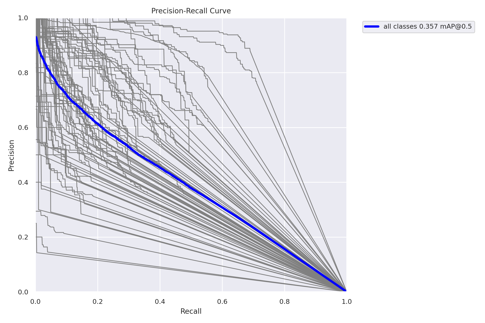
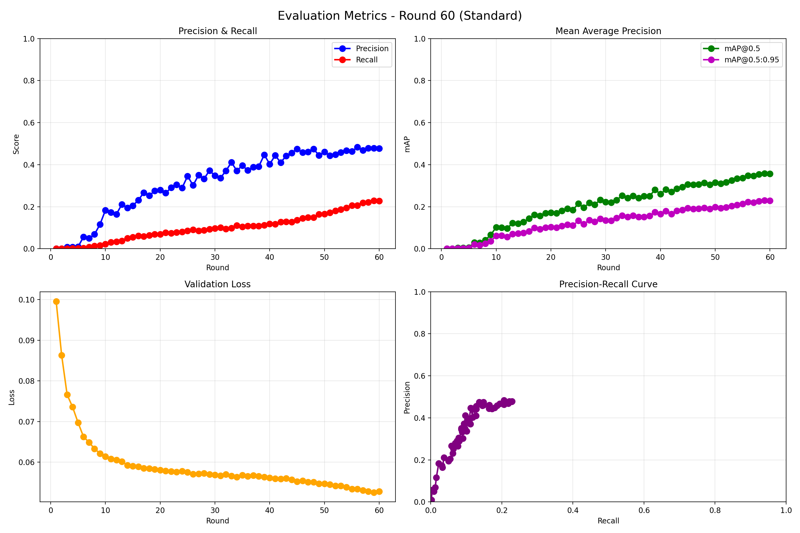
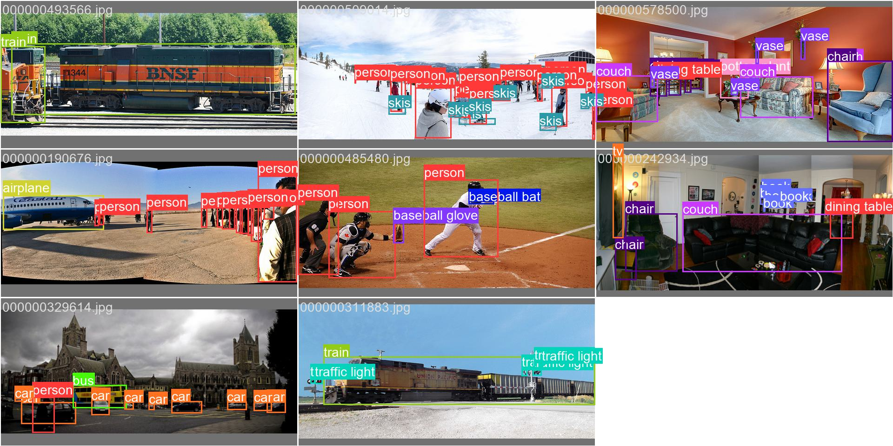
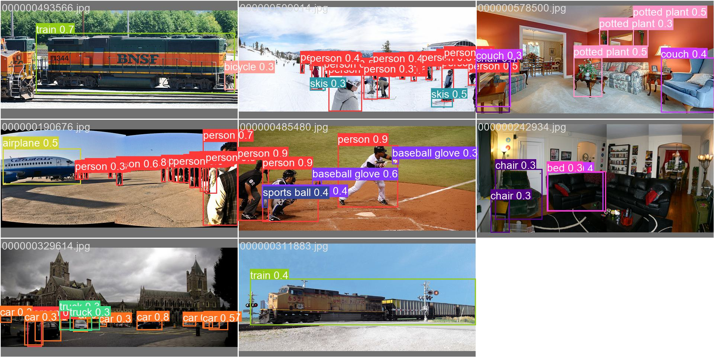

# Federated Learning for Object Detection with YOLOv5

A federated learning system for YOLOv5 object detection, built on [Flower](https://flower.dev/) and PyTorch. Clients train locally and never share raw images — only model weights cross the network.

The system supports three numerical precision modes (FP32, FP16, INT8 quantization-aware training) and an INT8-aware aggregation strategy on the server that cuts upload bandwidth by ~75% without changing the training loop.

Developed as part of an MEng thesis at the University of Patras, *Distributed Image Analysis Techniques — Federated Learning for Object Detection with YOLOv5 on Edge Devices* (supervisor: Prof. Konstantinos Berberidis).

---

## Why this exists

Federated learning is usually demonstrated on classification. Object detection is harder: the models are larger, the loss has three components, and the per-round payload is big enough that communication cost stops being a footnote.

This project asks a concrete question: **what does privacy actually cost, in accuracy, model size and gigabytes moved?** — and instruments the pipeline well enough to answer it.

---

## What's in here

| Component | File | What it does |
|---|---|---|
| **Server** | `src/federated_server.py` | `INT8SmartFedAvg` — a FedAvg subclass that aggregates quantized weights directly |
| **Client** | `src/federated_client.py` | YOLOv5 training client with FP32 / FP16 / INT8-QAT modes |
| **Orchestration** | `src/run_federated.py` | Launches the server and N clients, streams logs, produces visualizations |
| **Instrumentation** | `src/complexity_metrics.py` | FLOPs, parameters, latency percentiles, memory, GPU power, communication cost |
| **Result plots** | `src/visualize_results.py` | Combined per-client metrics, heatmaps, confidence curves, metric evolution |
| **Performance plots** | `src/visualize_complexity_metrics.py` | Cross-client comparison of latency, memory and communication cost |

---

## Two design decisions worth explaining

### 1. INT8 aggregation that keeps BatchNorm at INT16

The naive approach — quantize every tensor to INT8 before upload — breaks. BatchNorm running statistics (`running_mean`, `running_var`) have a far wider dynamic range than convolution weights, and squeezing them into 256 levels destabilizes training within a few rounds.

`INT8SmartFedAvg` therefore carries a **per-tensor dtype marker** alongside the weights: INT8 for most parameters, INT16 for BatchNorm statistics. The server dequantizes using each tensor's own scale, performs the weighted average in FP32, then re-quantizes into the same dtype it received.

```
client → [int8 weights] [int16 bn stats] [fp32 scales] [uint8 dtype markers] → server
server → dequantize → weighted FedAvg in fp32 → re-quantize → broadcast
```

If the metadata arrays are missing, aggregation silently falls back to standard FP32 FedAvg rather than failing — useful when mixing client versions.

### 2. QAT observers have to be reset every round

Quantization-aware training inserts fake-quantization nodes whose observers learn activation ranges during training. In federated learning, each round replaces the model weights wholesale — but the observers keep the ranges they calibrated against the *previous* round's weights. Those stale ranges progressively mis-scale activations until training collapses.

The client handles this in two steps after loading new parameters:

- `_reset_observers()` — clears `min_val` / `max_val` on every observer, tolerating observers (such as `HistogramObserver`) that don't implement a reset
- `_warmup_observers()` — runs a handful of batches with fake quantization *disabled* so observers re-calibrate on the new weights before gradients start flowing

This was the single most time-consuming failure mode in the project, and it does not appear in any federated learning tutorial.

---

## Results

The run included in `results/` is one configuration: **YOLOv5n, FP32, MS COCO, 5 clients × 60 rounds, 9000 images per client per round**, on a single NVIDIA Tesla V100 32 GB.

The thesis evaluates 58 scenarios across two datasets (COCO, VisDrone), two model variants (YOLOv5s, YOLOv5n) and five precision levels. This repository contains the framework plus one worked example, not the full study.

### Detection quality after 60 rounds

| Metric | Value |
|---|---|
| mAP@0.5 | 0.357 |
| mAP@0.5:0.95 | 0.229 |
| Precision | 0.477 |
| Recall | 0.228 |
| Best F1 | 0.28 @ conf 0.225 |



### Convergence

mAP climbs steadily across all 60 rounds with no plateau, suggesting the run was still improving when it stopped. Validation loss falls sharply over the first 10 rounds and then decays slowly.



### Model and runtime cost

| | YOLOv5n |
|---|---|
| Parameters | 1.87 M |
| FLOPs | 2.28 G |
| Model size (FP32) | 7.18 MB |
| Model size (FP16) | 3.57 MB |
| Inference latency | 18.7 ± 2.5 ms (p95: 28.1 ms) |
| Throughput | 54.6 FPS |
| GPU power draw | 155 W (inference), 147 W (training) |
| Training time | ~67 min per round per client |

### Communication cost

Each client uploads the full model every round:

```
7.18 MB × 60 rounds           =   431 MB per client
431 MB × 5 clients            =  2.15 GB per training run
```

With INT8 transmission enabled (`--use_int8` on the server), the same run moves roughly a quarter of that. The thesis reports 8.1 GB → 2.0 GB for the larger YOLOv5s model.

### Qualitative output

Ground truth (left) against predictions at round 60 (right):

| Labels | Predictions |
|---|---|
|  |  |

---

## Setup

```bash
git clone https://github.com/stefanossoul/federated-yolov5
cd federated-yolov5

python -m venv .venv && source .venv/bin/activate
pip install -r requirements.txt

# YOLOv5 is used as a source checkout
git clone https://github.com/ultralytics/yolov5
pip install -r yolov5/requirements.txt
```

### Data layout

Each client needs its own image directory. Partition COCO (or any YOLO-format dataset) across clients however your experiment requires — IID, or Dirichlet-sampled for non-IID:

```
datasets/coco/
├── client_0/
│   ├── images/*.jpg
│   └── labels/*.txt
├── client_1/
│   └── ...
└── images/val2017/      # shared validation set
```

### Paths

There is no config file yet — paths are set in `FederatedClient.__init__` in `src/federated_client.py` and resolved relative to the parent of the `src/` directory:

```python
self.data_path     = f'{self.base_path}/flower/yolov5/datasets/coco/client_{client_id}'
self.model_path    = f'{self.base_path}/flower/yolov5/models/yolov5n.yaml'
self.hyp_path      = f'{self.base_path}/flower/yolov5/data/hyps/hyp.scratch-high.yaml'
self.val_path      = f'{self.base_path}/flower/yolov5/datasets/coco/images/val2017'
self.coco_yaml_path = f'{self.base_path}/flower/yolov5/data/coco.yaml'
```

Edit these to match your layout before the first run. Moving them into a config file is on the list below.

---

## Running

The scripts resolve each other by name, so run them from inside `src/`.

Full run — server plus all clients:

```bash
cd src
python run_federated.py --num_clients 5 --rounds 60 --epochs 4 --min_clients 5
```

Server and clients separately, which is what you want across real machines:

```bash
# On the server
python federated_server.py --rounds 60 --min_clients 5 --port 8080

# On each client
python federated_client.py --client_id 0 --server_address <host>:8080 --precision fp32
```

### Precision modes

```bash
--precision fp32   # baseline
--precision fp16   # model.half(); ~50% model size and memory
--precision int8   # quantization-aware training
```

Two notes on INT8. Training uses the `qnnpack` backend (per-tensor quantization) rather than `fbgemm` (per-channel), because `fbgemm` is CPU-only and these clients train on GPU. And PyTorch does not fully support quantized inference on GPU, so the client moves the model to CPU for the INT8 conversion and evaluation step — slower, but it measures the real quantized model rather than a simulation.

### INT8 aggregation

```bash
python federated_server.py --rounds 60 --use_int8
```

### Visualizing collected metrics

`run_federated.py` calls `visualize_results.py` itself once training finishes. Both scripts can also be run on their own against an existing results directory:

```bash
python visualize_results.py --results_dir ../results --output_dir ../results/combined
python visualize_complexity_metrics.py --results_dir ../results --output_dir ../results/plots
```

---

## What the instrumentation records

`ComplexityTracker` writes per-round CSVs and a summary JSON for each client:

- **Complexity** — parameters, FLOPs, MACs, model size in FP32/FP16
- **Inference** — mean/median/p50/p95/p99 latency, throughput, images per second
- **Memory** — GPU allocated/reserved/peak, CPU RSS, system utilization
- **Hardware** — GPU utilization, temperature, power draw (via NVML)
- **Communication** — upload size per round, cumulative transfer
- **Efficiency** — ms per GFLOP, FPS per GFLOP, memory per million parameters

Sample output is in `results/` for the run described above.

---

## Known limitations

- **Paths are hardcoded.** Dataset, model and hyperparameter paths live in `federated_client.py` and have to be edited by hand (see Setup). They belong in a config file.
- **Hardcoded aggregation strategy.** The server implements FedAvg only. FedProx, FedAdam and friends would need their own `aggregate_fit`.
- **Hyperparameters are hardcoded too.** The learning-rate schedule, GPU memory fraction and batch-size thresholds are literals in the client rather than configurable.
- **Client failures aren't handled gracefully.** A client crashing mid-round takes down the round rather than being dropped from the average.
- **Data partitioning is out of scope.** The Dirichlet non-IID splits used in the thesis were produced by a separate script not included here.
- **Evaluation is per-client.** Each client validates against the shared validation set and the server averages the results; there is no centralized evaluation of the aggregated model.
- **`create_final_confidence_curves` is incomplete.** Only the F1 curve is implemented; the precision, recall and PR variants are marked TODO.
- **`set_parameters` rebuilds the model each round** rather than loading a state dict in place. Correct, but wasteful — it was a workaround for an inference-mode tensor conflict.

---

## Citation

```bibtex
@mastersthesis{soulis2026federated,
  title  = {Distributed Image Analysis Techniques: Federated Learning for
            Object Detection with YOLOv5 on Edge Devices},
  author = {Soulis, Stefanos},
  school = {University of Patras, Department of Electrical and
            Computer Engineering},
  year   = {2026},
  type   = {{MEng} Thesis}
}
```

---

## License

MIT — see [LICENSE](LICENSE). Note that YOLOv5 itself is AGPL-3.0 and is used here as an external dependency.
